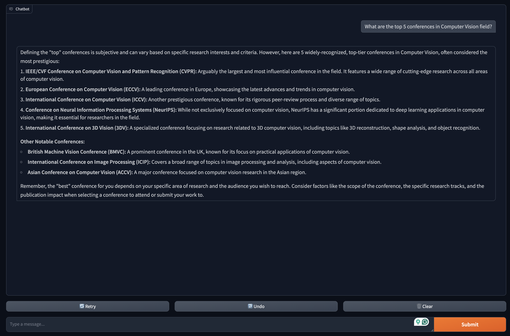
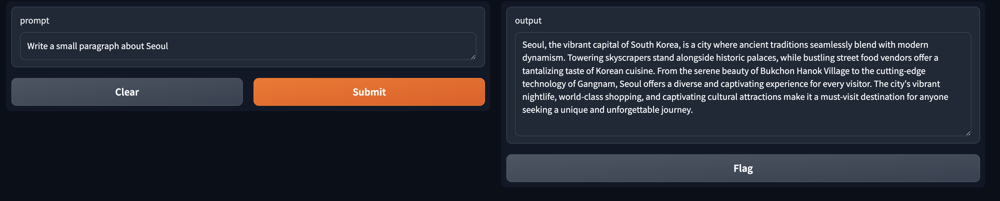

<!-- 
 -->
<!--  -->
[[Project]](https://vcl.seoultech.ac.kr/research.html)

# BudgetGPT - Official Implementation
This is a demo for BudgetGPT - a multi-purpose LLM application with UI using Google Gemini API

## Requirements
An API key from Google Gemini is needed to run this demo. Please visit [here](https://aistudio.google.com/app/apikey) to obtain your personal API key

-python>=3.10 \
-google-generativeai>=0.8.1 \
-google-ai-generativelanguage>=0.6.9 \
-gradio>=4.44.0 \

Please run `pip install -r requirements.txt` to install all the necessary packages

## Run demo
1. Chatbot
`bash test_chatbot.sh`

2. Text completion
`bash test_textgen.sh`

